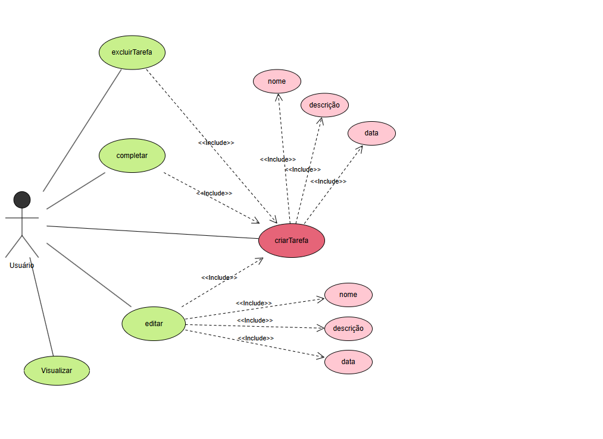

# 'ZenList' - Lista de Tarefas 
🆗 _Um sistema simples para gerenciamento de tarefas_

#### ♾️ O projeto foi realizado com a intenção de colocar em prática alguns conceitos, e será constantemente usado como base para estudos sendo atualizado a cada progresso no processo.

## 🌟 Descrição | Funcionalidades
Sistema que permite ao usuário criar e gerenciar uma lista de tarefas com funcionalidades de:
- **Incluir** uma nova tarefa preenchendo um formulário com nome, descrição e data.
- **Editar** e **excluir** tarefas existentes.
- **Concluir** tarefas adicionadas. ✔️


#

### UML | Diagrama de casos de uso




## ❗ Requisitos | Tecnologias

#### Este projeto utiliza a linguagem Python e o framework Flask para execução. <br/> Também foram utilizados: Bootstrap, Jinja2 e SQLite.<br/>

As dependências do projeto estão listadas no arquivo requirements.txt.


## Execução
1. Clone este repositório.
```bash
git clone https://github.com/seu-usuario/seu-repositorio.git

